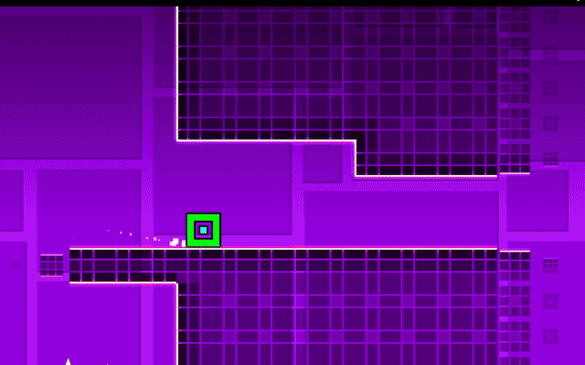
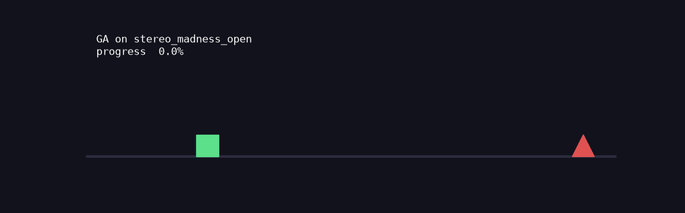
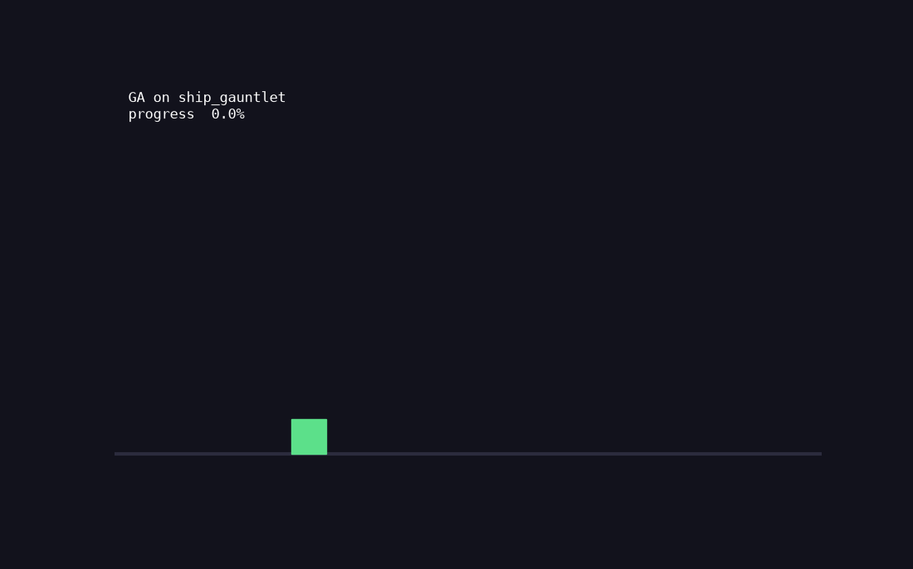
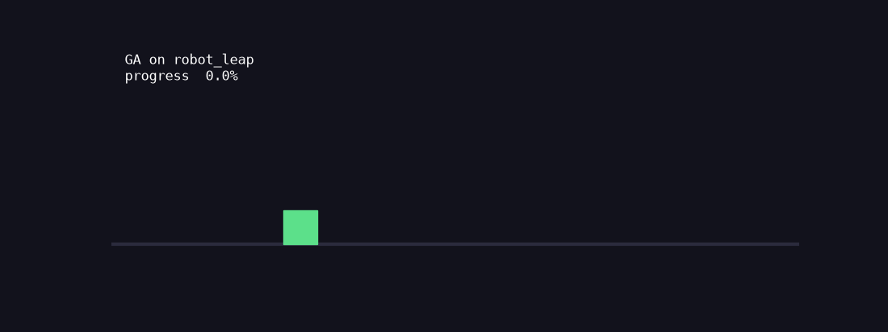
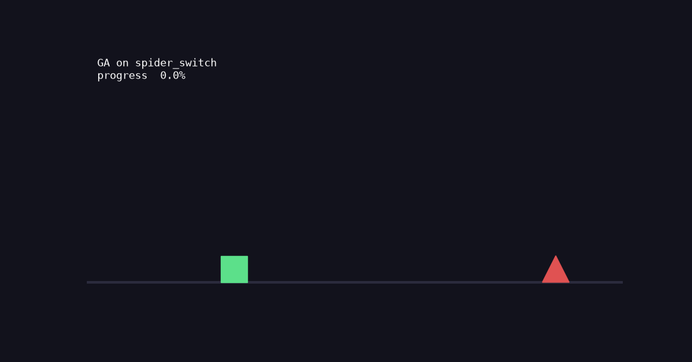

# geometry-dash-rl

Reinforcement-learning agents for **Geometry Dash** — trained in a fast headless
simulator and deployed on the **retail game** through a custom C++ mod. The
project covers a controlled DQN/PPO/GA comparison, sim-to-real transfer, and a
full-level clear via learning from demonstration.



*An agent completing the ship section of the official Stereo Madness on retail
Geometry Dash 2.2.*

**[📄 Case study](CASE_STUDY.md)** · **[Results & methodology](results/RESULTS.md)** · 48 tests · Python + PyTorch + C++/Geode

---

## What's here (and what each claim actually means)

| Result | What it is — precisely |
|--------|------------------------|
| **DQN vs PPO vs GA comparison** | Controlled, seeded experiment (5 seeds) in the sim. Reproducible finding: with default exploration, on-policy PPO gets trapped in a local optimum (4/5 seeds) that DQN and GA sidestep — a 5× entropy increase is what escapes it. |
| **Sim-to-real transfer** | A policy trained *only in the sim* drives the retail game via the mod, reaching ~11%; a checkpoint search on the real game clears the full cube section (~35%). |
| **Domain randomization** | Training across randomized physics (±18%/episode) widens the policy's tolerance to the sim-to-real gap by **~1.7×** vs a point estimate, measured on held-out physics perturbations (`results/robustness.png`). |
| **Full-level clear** | The complete official level, via **learning from demonstration** — a recorded human run replayed deterministically on the real game (not autonomous RL; see [Honest scope](#honest-scope--limitations)). |
| **Behavior cloning** | A policy trained on that demonstration predicts the human's jumps at **90.7% val accuracy (jump F1 0.82)**. |

## Why a simulator (the core idea)

Prior work ([geometry-dash-ai](https://github.com/ThePickleGawd/geometry-dash-ai))
trains RL agents **inside the running game**, capping learning at real time
(60 fps). This project decouples training from the game: a **headless simulator**
runs the physics at **>2,000× real time** (~150k–240k steps/sec on one CPU core),
so agents train in seconds, and the retail game — reached through a
[Geode](https://geode-sdk.org) mod — is the **evaluation target**, not the
training loop. Agents observe **structured state** (player kinematics + a
look-ahead occupancy grid), which is far more sample-efficient than pixels.

## Results

### Controlled algorithm comparison

3 algorithms × 5 seeds × 2 levels, identical observation/reward, greedy
evaluation. Reproduce with `python sweep.py --seeds 0 1 2 3 4 && python evaluate.py && python plot.py`.
Full methodology: [`results/RESULTS.md`](results/RESULTS.md).


Given each method its own hyperparameters, **all three solve both levels on all
5 seeds** — the interesting part is *what each needed to get there*. The GA
converges in a few thousand steps (deterministic levels make one rollout an exact
fitness signal); DQN in ~400k; PPO in ~1M. And PPO only gets there with tuned
exploration:

**Finding — PPO's local-optimum trap.** `blocks_and_spikes` gives free progress
up to the first block-over-spike jump (~21.6%), where a mistimed jump costs −10.
With its **default** entropy coefficient (0.01), PPO converges to "take the free
progress, don't risk the jump" and stalls at exactly 21.6% on **4/5 seeds**,
through the full 3M-step budget. A 5× entropy increase (0.01 → 0.05) escapes it
on all 5. DQN and GA never fall in. A single-algorithm project cannot surface
this.


### Sim-to-real robustness: domain randomization

Training on one exact set of physics constants overfits the sim; the standard
fix is to randomize the physics each episode so the policy tolerates a *range*.
Trained with vs without ±18% domain randomization (5 seeds), then evaluated
across held-out physics perturbations:


DR widens the ≥90%-progress tolerance band by **~1.7×** on both jump strength
and speed, and degrades gracefully where the point-estimate policy cliffs. Full
methodology: [`results/RESULTS.md`](results/RESULTS.md). Reproduce with
`python dr_experiment.py`.

### Sim-to-real and the full clear

- **Watch a sim policy on the real game** — `results/real_stereo_clip.gif`
  (dies ~11% at a physics-gap obstacle).
- **The full clear** — `results/agent_clears_stereo_madness.mp4` (learning from
  demonstration, 100%).

| Sim (GA on the imported opening) | Ship | Robot | Spider |
|---|---|---|---|
|  |  |  |  |

## How it works

```
Headless sim ──► RL agents (DQN/PPO/GA) ──► Python bridge ──► Geode C++ mod ──► retail game
 >2,000× RT         controlled comparison      binary socket      hooks + input inject
```

- **`gdrl/sim/`** — deterministic physics for all seven gamemodes, slopes,
  gravity/speed portals. `step()` is a pure function of (state, action, level).
- **`gdrl/envs/`** — Gymnasium env (`GDEnv`, sim backend) and the real-game
  bridge (`GDRealEnv`, `RealGameBridge`) sharing one observation builder, so a
  sim-trained policy sees identical inputs on the real game.
- **`gdrl/agents/`** — `dqn.py` (double DQN), `ppo.py` (GAE, vectorized envs),
  `ga.py` (elitism + Gaussian mutation).
- **`gd-mod/`** — C++ Geode mod: hooks `GJBaseGameLayer::update`, streams state
  and injects input over a length-prefixed binary protocol (`src/protocol.hpp`,
  mirrored in `gdrl/envs/protocol.py`). Built and verified on **GD 2.2081**.
- **Test-first bridge:** a protocol-faithful mock of the game backed by the sim
  (`gdrl/envs/mock_mod.py`) verifies the entire Python↔game path (`tests/test_bridge.py`)
  without the game — sim-vs-bridge observations match to float32 precision.

## Repository layout

```
gdrl/sim/        physics simulator (7 gamemodes, slopes, portals)
gdrl/envs/       Gymnasium env + real-game bridge + sim-backed mock + protocol
gdrl/agents/     dqn.py, ppo.py, ga.py
gdrl/levels/     Geometry Dash level-string importer (base64/zlib, object tables)
gdrl/models/     MLP / actor-critic networks
configs/         one YAML recipe per experiment
levels/          level files (JSON)
gd-mod/          Geode C++ mod (protocol, socket server, hooks) + build recipe
tests/           48 tests: physics, env API, determinism, bridge, gamemodes, importer
results/         comparison figure, RESULTS.md, footage
train.py sweep.py evaluate.py plot.py play.py render.py       # sim workflow
dr_experiment.py                                              # domain-randomization robustness study
prepare_real_level.py play_real_agent.py beat_level.py        # real-game workflow
record_play.py train_bc.py                                    # learning from demonstration
```

## Setup

Requires Python 3.10+.

```bash
python3.11 -m venv .venv && source .venv/bin/activate
pip install -e ".[dev]"
pytest                 # 48 tests: physics, env, determinism, bridge, importer
```

### Reproduce the headline results (sim only, no game needed)

```bash
python sweep.py --seeds 0 1 2 3 4        # DQN/PPO/GA × 5 seeds × 2 levels
python evaluate.py                       # greedy eval -> runs/summary.csv
python plot.py                           # -> results/comparison.png
python dr_experiment.py                  # domain-randomization robustness -> results/robustness.png
python render.py --run runs/ga_stereo_open --algo ga --level stereo_madness_open --out out.gif
```

### The real-game workflow (needs GD 2.2 on Steam + the Geode mod)

Build/run instructions are in [`gd-mod/README.md`](gd-mod/README.md). Once the
mod is loaded and you're in a level:

```bash
python play_real_agent.py --run runs/ga_stereo_open --algo ga --level stereo_madness  # sim policy on real game
python record_play.py --out recordings/run.json      # record a human clear
python record_play.py --replay recordings/run.json   # replay it (deterministic)
python train_bc.py --rec recordings/run.json         # behavior cloning on the demo
```

## Environment specification

| | |
|---|---|
| Action | `Discrete(2)` — release / hold (jump). Matches the game's single binary input. |
| Observation | 412 floats: player `[y, vy, grounded, frac_x]` + look-ahead grid (20×10×{solid, hazard}) + gamemode one-hot (7) + gravity |
| Reward | `+Δx` per step (blocks), `−10` on death, `+10` on completion |
| Episode end | death, completion, or step cap |

Cube-mode physics (`gdrl/sim/physics.py`) are **calibrated against logged real
trajectories** — jump apex 2.128 blocks over 25 frames, 10.39 blocks/s at 1× —
fit to the sim's discrete integration, not the textbook formula. The other
gamemodes are approximate (see below).

### Gamemodes

All seven are implemented; the observation carries a gamemode one-hot + gravity
so one policy conditions on the current mode. Each is verified as a real control
task by a GA learning a dedicated level where constant policies die
(`ship_gauntlet`, `robot_leap`, `spider_switch`).

| Mode | Input behaviour | Fidelity |
|------|-----------------|----------|
| cube  | hold = jump when grounded | calibrated |
| ship  | hold = thrust, release = fall | approximate |
| wave  | hold = up 45°, release = down 45° | approximate |
| ball  | tap = flip gravity | approximate |
| ufo   | tap = upward impulse | approximate |
| robot | hold = variable-height jump | approximate |
| spider| tap = teleport to opposite surface | approximate |

## Honest scope & limitations

I'd rather state these up front:

- **The guaranteed full clear is deterministic replay of a human demonstration,
  not an autonomous RL agent solving the level.** The behavior-cloning policy
  *learns* the input mapping (90.7% val acc) but, like BC on a single
  frame-perfect level, drifts — so replay is used for the exact clear.
- **Sim-to-real transfer dies at ~11%** for the point-estimate policy. Two
  things narrow the gap: calibrating the cube jump against logged real
  trajectories (the old constants undershot the real apex by ~8%), and training
  with domain randomization (~1.7× wider physics tolerance, measured in sim). I
  have not yet re-run the *on-real* transfer with both, so the ~11% figure is
  the un-hardened baseline, not the current ceiling. Autonomous checkpoint
  search reaches ~35% (the cube section) before the ship section's continuous
  control.
- **Non-cube physics are approximate** (chosen for plausible motion, pending
  calibration against logged real trajectories); robot/spider are first-pass.
- **The mod targets macOS + GD 2.2081** (Geode's supported build). Field reads
  are marked `VERIFY` in `gd-mod/src/main.cpp`.

## Roadmap

- [x] Headless sim (7 gamemodes), Gymnasium env, structured observations
- [x] DQN / PPO / GA trainers + seeded comparison sweep + figure
- [x] Geode mod built & verified on real GD 2.2081 (state stream + input inject + checkpoints)
- [x] GD level-string importer (base64/zlib, object-type classification)
- [x] Sim-to-real transfer + on-real-game checkpoint search
- [x] Learning from demonstration (record/replay) + behavior cloning
- [x] Cube-jump calibration against logged real trajectories
- [x] Domain randomization + measured robustness to the sim-to-real gap
- [ ] Non-cube physics calibration against logged trajectories
- [ ] Re-run on-real transfer with the hardened (calibrated + DR) policy
- [ ] Dual/mini modes; per-mode hitboxes
- [ ] Pixel-observation ablation; W&B tracking
