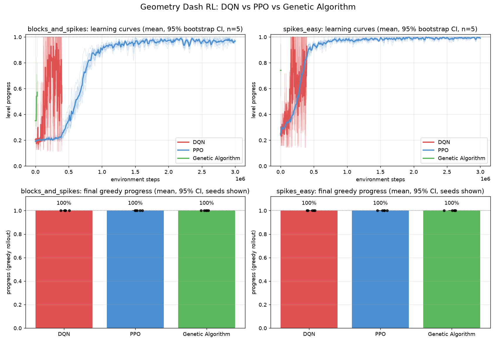
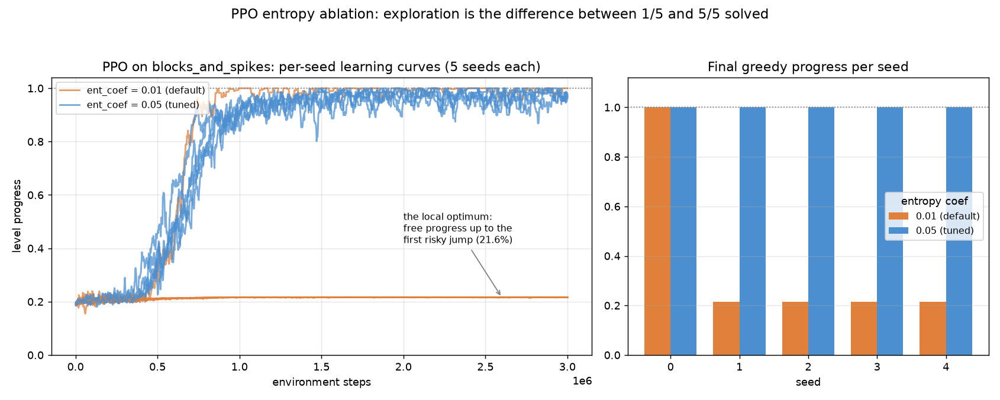
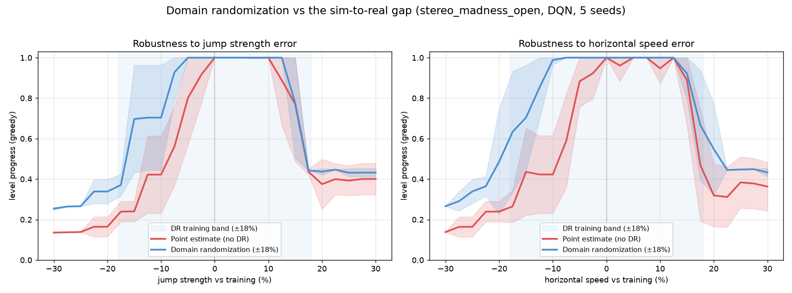

# Comparison results: DQN vs PPO vs Genetic Algorithm

Setup: 3 algorithms × 5 seeds (0–4) × 2 levels, identical observation, action
space and reward. Trained in the headless sim; evaluated with a single
**greedy** (deterministic, argmax) rollout per run — the sim is deterministic so
one rollout is an exact measurement. Reproduce with:

```bash
python sweep.py --seeds 0 1 2 3 4 --levels spikes_easy blocks_and_spikes
python evaluate.py && python plot.py
```



## Final greedy performance (% of level completed, 5 seeds)

| Algorithm | spikes_easy | blocks_and_spikes | Seeds solved (of 10) |
|-----------|:-----------:|:-----------------:|:--------------------:|
| **DQN** (double)          | **100%** (5/5) | **100%** (5/5) | **10/10** |
| **Genetic Algorithm**     | **100%** (5/5) | **100%** (5/5) | **10/10** |
| **PPO** (tuned, ent=0.05) | **100%** (5/5) | **100%** (5/5) | **10/10** |

With each method given its own hyperparameters, all three solve both levels on
every seed. The interesting result isn't the final scoreboard — it's *what each
method needed to get there*, and PPO's sensitivity to exploration in particular.

## Findings

**1. All three solve the task, but sample efficiency differs by orders of
magnitude.** The GA reaches 100% on `spikes_easy` in a few thousand environment
steps (the near-vertical green sliver in the learning curves) because a
deterministic level makes a single rollout an exact fitness signal; it converges
on `blocks_and_spikes` in ~85 generations. DQN solves within ~400k steps, though
its *training* curve is noisy (logged under ε-greedy exploration; greedy eval is
100%). PPO needs ~1M of its 3M-step budget to climb.

**2. PPO falls into a local optimum unless you force exploration — and that's
the real finding.** `blocks_and_spikes` gives free forward progress up to the
first block-over-spike jump (~21.6%), where a mistimed jump costs −10. With its
**default** entropy coefficient (0.01), on-policy PPO converges to "collect the
free progress, don't risk the jump" and stalls at exactly **21.6% on 4 of 5
seeds**, staying trapped through the full 3M-step budget. Raising the entropy
coefficient 5× (0.01 → 0.05) escapes the trap on all 5 seeds. Value-based (DQN)
and evolutionary (GA) methods never fall in — they solve every seed at their
default settings.



Reproduce the ablation:

```bash
for s in 0 1 2 3 4; do
  python train.py --config configs/ppo.yaml --run-name ablation_ppo_ent001_s$s \
    --override level=blocks_and_spikes seed=$s ent_coef=0.01
done
```

**3. Structured observations + the fractional-x fix make DQN stable.** With the
block-aligned grid alone, the exact jump frame was aliased across ~6 frames and
DQN was erratic; adding the sub-block x-offset to the observation took DQN to
solving every seed. (This is also why the DQN training curve looks noisy while
its greedy evaluation is a clean 100%.)

## Why this is a stronger result than the prior single-algorithm work

[geometry-dash-ai](https://github.com/ThePickleGawd/geometry-dash-ai) reports a
DQN (and MoE-DQN) that plays the game, but with no controlled comparison across
algorithm families, no seed statistics, and training capped at real time. Here,
identical conditions across three algorithm families and five seeds surface a
concrete, reproducible finding — PPO's default-exploration local-optimum trap on
precision timing, and the exact entropy change that escapes it — that a
single-algorithm project cannot show. All 30 sweep runs plus the ablation
finished in about an hour on one CPU core thanks to the headless sim.

## Sim-to-real robustness: domain randomization

The sim's physics are only an approximation of the real game's, so a policy that
overfits one exact set of constants is brittle to the sim-to-real gap (the
sim-trained policy dies ~11% into the real level for exactly this reason). The
standard defense is **domain randomization**: jitter the physics every episode
so the policy learns to survive a *range* of physics rather than a single point
estimate.

Setup: DQN trained with and without domain randomization (±18% per-episode
jitter of jump strength, gravity and horizontal speed) on the imported Stereo
Madness opening, 5 seeds each, then greedy-evaluated across a held-out sweep of
physics perturbations. Reproduce with:

```bash
python dr_experiment.py --seeds 0 1 2 3 4 --level stereo_madness_open
```



| Perturbation axis | Point estimate (no DR) | Domain randomization | Improvement |
|-------------------|:----------------------:|:--------------------:|:-----------:|
| Jump strength     | ≥90% over a **12%**-wide band | ≥90% over a **20%**-wide band | **1.7×** |
| Horizontal speed  | ≥90% over a **15%**-wide band | ≥90% over a **25%**-wide band | **1.7×** |

**Finding.** Domain randomization widens the tolerance band (progress ≥ 90%) by
~1.7× on both axes and degrades gracefully where the point-estimate policy falls
off a cliff — a direct, quantified demonstration that DR mitigates the
sim-to-real gap. It is not a cure-all: beyond ±15% both policies fail at a
timing-critical obstacle, which is the honest ceiling of observation-only
transfer without further calibration.

## Caveats

- Levels are two hand-built sim levels, not official GD levels (though the
  level-string importer can load real ones, e.g. `stereo_madness_open` used in
  the DR study). Absolute numbers change on real levels; the *relative* algorithm
  behavior is the transferable result.
- Each method uses its own hyperparameters/budget, as is standard. PPO is the
  only one that needed tuning (higher entropy) to clear the hard level reliably —
  that sensitivity is itself the finding, isolated in the ablation above.
- **Honest note on a result that changed:** an earlier version of this writeup
  (3 seeds, before the cube-jump calibration) reported the *tuned* PPO config
  itself trapping on 2/3 seeds. After calibrating the jump (+8% apex), the tuned
  config solves all seeds, and the local-optimum trap now appears cleanly only
  under default exploration. The docs were updated to match the current code; the
  underlying finding — PPO's exploration sensitivity on this local optimum — is
  unchanged and, if anything, cleaner.
